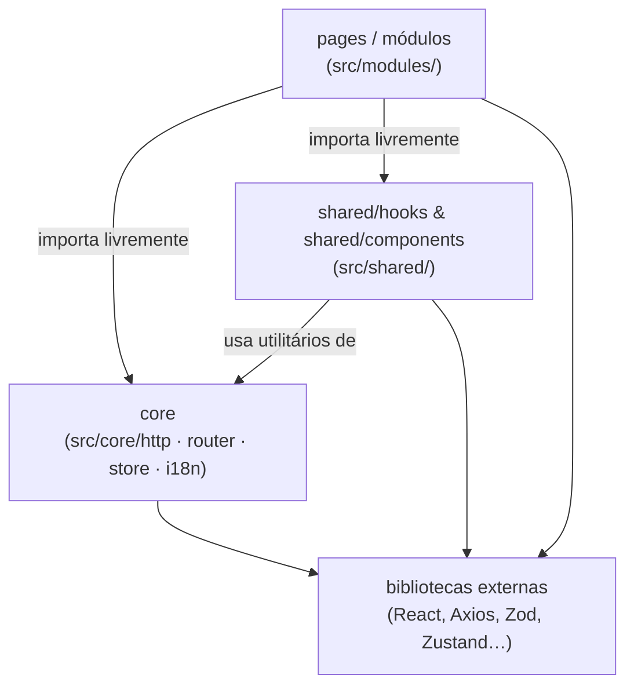

# Governança de Código — atlas-front-react

## 0. Setup & Desenvolvimento

### Pré-requisitos

- Node.js 20+
- npm 10+

### Instalação

```bash
npm install
```

### Variáveis de ambiente

Crie o arquivo `.env` na raiz do projeto `atlas-front-react/`:

```env
VITE_API_URL=http://localhost:8000/api
```

> Para apontar para a API em produção substitua pelo endereço real. O valor é injetado no Axios via `import.meta.env.VITE_API_URL` em `src/core/http/api.ts`.

### Comandos

| Comando          | O que faz                                         |
| ---------------- | ------------------------------------------------- |
| `npm run dev`    | Inicia o servidor de desenvolvimento Vite com HMR |
| `npm run build`  | Build de produção em `dist/`                      |
| `npm run lint`   | Executa o ESLint em todo o projeto                |
| `npm run format` | Formata o código com Prettier                     |

### Atlas CLI — gerador de módulos

O projeto inclui um scaffolder de linha de comando que gera todos os 13 arquivos de boilerplate de um módulo CRUD, cria os arquivos i18n correspondentes, e registra a rota automaticamente.

```bash
npm run atlas -- create module <nome>
```

**Exemplos:**

```bash
npm run atlas -- create module product
npm run atlas -- create module productCategory
npm run atlas -- create module product-category
```

**O que é gerado:**

- `src/modules/<kebab>/` — árvore completa do módulo (13 arquivos)
- `src/mock/languages/<kebab>/<kebab>-listing.json` — chaves i18n de listagem (pt-BR, en-US, es-ES)
- `src/mock/languages/<kebab>/<kebab>-detail.json` — chaves i18n de detalhe (pt-BR, en-US, es-ES)
- Patch em `src/core/i18n/index.ts` — imports e spreads de listing + detail
- Patch em `src/core/router/index.tsx` — imports e rota aninhada com listing + detail

**Pós-geração — checklist manual:**

1. Revisar o endpoint da API em `services/<kebab>.service.ts` (gerado como `/<kebab-plural>`)
2. Ajustar o `path` da rota no router se necessário (gerado como `/<kebab>`)
3. Adicionar a chave `menu.<feature>` em `src/mock/languages/menu/menu.json`
4. Preencher campos customizados em types, schemas, forms e containers

### Desenvolvimento sem backend de autenticação

O backend ainda não expõe o endpoint `POST /auth/login`. Para acessar a aplicação em ambiente de desenvolvimento sem autenticar:

```ts
// Cole no console do navegador (F12 → Console)
localStorage.setItem('atlas-token', 'dev-token')
```

Navegue para `http://localhost:5173` após executar o comando. O `ProtectedRoute` lê esse valor e libera o acesso. Remova a chave para testar o fluxo de redirecionamento ao login.

### Alias de paths

Todos os imports internos usam o alias `@/` configurado no `vite.config.ts`:

```
@/ → src/
```

Exemplos:

```ts
import { httpRequest } from '@/core/http/request.helper'
import { useListing } from '@/shared/hooks/useListing'
import { Button } from '@/shared/components/ui/button'
```

Nunca use caminhos relativos longos (`../../../shared/…`). Sempre prefira `@/`.

---

## 1. Arquitetura & Módulos

### Visão geral das camadas

O projeto segue uma divisão em quatro camadas estanques. A regra de ouro é: **dependências só fluem para baixo** — nunca uma camada inferior importa de uma superior.



**Regras de fronteira:**

| Camada               | Pode importar de     | Nunca importa de                 |
| -------------------- | -------------------- | -------------------------------- |
| `modules/<feature>/` | `shared/`, `core/`   | outros módulos                   |
| `shared/`            | `core/`              | `modules/`                       |
| `core/`              | bibliotecas externas | `modules/`, `shared/components/` |

> Violação conhecida: `useDashboardStats` importa do serviço de `indication`. Candidata a extração para `shared/` ou para uma camada de agregação.

> Exceção estrutural: `src/core/router/index.tsx` importa de `shared/components/` (layouts, ProtectedRoute) e de `modules/` (page components). O router é o único ponto de wiring permitido nessa direção — não é um padrão replicável em outros arquivos de `core/`.

---

### Criando um novo módulo

#### 1. Estrutura de diretórios

> **Regra de nomenclatura:** use sempre o **singular** do domínio como nome do módulo — `organization`, não `organizations`; `product`, não `products`. O CLI e todos os sufixos (tipo, função, arquivo) derivam desse singular. Nomes plurais causam duplicações (`useOrganizationss`, `ApiOrganizations`) e tipos semanticamente errados (uma `interface` representa uma instância, não uma coleção).

```
src/modules/<feature>/
├── <Feature>ListingPage.tsx
├── <Feature>DetailPage.tsx
├── types/<feature>.type.ts
├── schemas/<feature>.schema.ts
├── services/<feature>.service.ts
├── hooks/
│   ├── use<Feature>.ts
│   ├── use<Feature>Create.ts
│   ├── use<Feature>Edit.ts
│   ├── use<Feature>Detail.ts
│   └── use<Feature>FormOptions.ts
├── components/
│   ├── <Feature>CreateForm.tsx
│   └── <Feature>EditForm.tsx
└── containers/
    ├── <Feature>MainContainer.tsx
    ├── <Feature>LocationContainer.tsx
    ├── <Feature>OrganizationContainer.tsx
    └── <Feature>AuditContainer.tsx
```

#### 2. Registrar as rotas

Edite `src/core/router/index.tsx` e adicione as rotas dentro do bloco `ProtectedRoute > MainLayout`:

```tsx
// rota de listagem (breadcrumb estático via chave i18n)
{
  path: 'meu-modulo',
  handle: { breadcrumb: 'menu.myModule' },
  children: [
    { index: true, element: <MyModuleListingPage /> },
    // rota de detalhe (breadcrumb dinâmico resolvido em runtime)
    { path: ':id', handle: { dynamicBreadcrumb: true }, element: <MyModuleDetailPage /> },
  ],
},
```

- `handle.breadcrumb` — chave i18n; `AppHeader` resolve com `t()`.
- `handle.dynamicBreadcrumb: true` — página de detalhe chama `useBreadcrumbStore.setTitle(data.name)`.

#### 3. Registrar traduções i18n

O CLI gera e registra os dois arquivos automaticamente. Para módulos criados manualmente, crie os JSONs em `src/mock/languages/<feature>/` e registre ambos em `src/core/i18n/index.ts`:

```ts
import myModuleDetail from '@/mock/languages/my-module/my-module-detail.json'
import myModuleListing from '@/mock/languages/my-module/my-module-listing.json'

const mergeTranslations = (lang: string) => ({
  // ... namespaces existentes ...
  ...myModuleDetail[lang as keyof typeof myModuleDetail],
  ...myModuleListing[lang as keyof typeof myModuleListing],
})
```

Todas as chaves seguem o formato de dois níveis: `<namespace>.<chave>` (ex: `myModuleListing.table.columns.name`).

#### 4. i18n na prática

**Usando traduções em componentes:**

```tsx
import { useTranslation } from 'react-i18next'

function MeuComponente() {
  const { t } = useTranslation()
  return <p>{t('common.loading')}</p>
}
```

**Estrutura do arquivo de traduções**

As traduções de cada feature são divididas em dois arquivos dedicados:

- **`src/mock/languages/<feature>/<feature>-listing.json`** — chaves de listagem e formulários do feature
- **`src/mock/languages/<feature>/<feature>-detail.json`** — chaves de detalhe do feature

Conteúdo de `<feature>-listing.json`:

```jsonc
{
  "pt-BR": {
    "<feature>Listing": {
      "page": {
        "title": "<Feature>",
        "description": "Gerencie os registros de <Feature>",
      },
      "table": {
        "columns": {
          "name": "Nome",
          "createdAt": "Criado em",
          "actions": "Ações",
        },
      },
      "create": {
        "title": "Novo Registro",
        "description": "Preencha os dados abaixo",
        "form": {
          "name": { "label": "Nome", "placeholder": "Digite o nome" },
          "errors": { "name": "O nome é obrigatório." },
        },
      },
      "edit": {
        "title": "Editar Registro",
        "description": "Atualize os dados abaixo",
      },
    },
  },
  "en-US": {
    /* mesma estrutura em inglês */
  },
  "es-ES": {
    /* mesma estrutura em espanhol */
  },
}
```

Conteúdo de `<feature>-detail.json`:

```jsonc
{
  "pt-BR": {
    "<feature>Detail": {
      "breadcrumb": "Detalhes de <Feature>",
      "backToList": "Voltar à lista",
      "sections": { "main": "Dados Gerais" },
      "fields": { "id": "ID", "name": "Nome" },
    },
  },
  "en-US": {
    /* mesma estrutura em inglês */
  },
  "es-ES": {
    /* mesma estrutura em espanhol */
  },
}
```

**Interpolação de variáveis:**

```ts
// Chave: "textPagination": "Página {{currentPage}} de {{totalPages}}"
t('common.textPagination', { currentPage: 1, totalPages: 10 })
// → "Página 1 de 10"
```

**Convenção de chaves:** dois níveis — `<namespace>.<chave>`. Namespaces de feature usam camelCase (`indicationListing`, `indicationDetail`). Chaves globais ficam em `common.*`.

---

## 2. Design Patterns

### Padrão 1 — Service Object (Módulo de Funções Puras)

**Intenção:** isolar toda comunicação HTTP e mapeamento de dados numa camada sem estado. Hooks consomem serviços; páginas consomem hooks.

**Onde é usado:** `src/modules/indication/services/indication.service.ts`

```ts
// Função pura exportada; recebe tipos do domínio, retorna tipos do domínio.
export async function fetchIndications(
  filter: ListingFilter
): Promise<FetchResponse<IndicationRow>> {
  const { search, page, limit, signal } = filter
  const response = await httpRequest<ApiIndicationListResponse>(
    'GET',
    '/geographical-indications',
    undefined,
    { params: { page, per_page: limit, search }, signal }
  )
  const rows: IndicationRow[] = response.data.map((item) => ({
    id: item.id,
    ip: item.ip,
    name: item.name,
    cityId: item.city_id,
    organizationId: item.organization_id,
    concessionDate: item.grant_date,
    createdAt: formatDate(item.created_at),
  }))
  return {
    data: rows,
    meta: {
      /* ... */
    },
  }
}
```

**Como replicar:** crie `src/modules/<feature>/services/<feature>.service.ts`. Exporte apenas `async function`s nomeadas. Nunca exporte classes. Tipos internos da API ficam privados no arquivo; tipos do domínio ficam em `types/<feature>.type.ts`.

---

### Padrão 2 — Hook como Estratégia (Dependency Injection via prop)

**Intenção:** `useListing` fornece toda a infraestrutura de paginação, busca e cancelamento. O chamador injeta apenas a estratégia de busca de dados.

**Onde é usado:** `src/shared/hooks/useListing.ts`, consumido em `src/modules/indication/hooks/useIndication.ts`

```ts
const { data, isLoading, pagination, searchInput, setSearchInput, submitSearch, setPage, reload } =
  useListing<IndicationRow>({ fetcher: fetchIndications, enablePagination: true })
```

**Como replicar:** passe qualquer função `(ListingFilter) => Promise<FetchResponse<T>>` como `fetcher`. O hook gerencia abort, estado de loading e paginação automaticamente.

---

### Padrão 3 — Decomposição de Hook por Responsabilidade Única

**Intenção:** cada operação de negócio vive num hook próprio. A página orquestra, mas não contém lógica.

**Onde é usado:** `src/modules/indication/hooks/`

```
useIndication.ts       → listagem + exclusão
useIndicationCreate.ts → abertura de formulário + submissão de criação
useIndicationEdit.ts   → abertura de formulário + submissão de edição
useIndicationDetail.ts → busca por ID com AbortController
useIndicationFormOptions.ts → opções de select (cidades, organizações)
```

**Como replicar:** um hook por operação. O hook de listagem recebe `reload` do `useListing`; hooks de mutação recebem `onSuccess?: () => void` para acionar o reload de quem os chama.

---

### Padrão 4 — Observer / Singleton de Estado (Toast)

**Intenção:** `toast()` é chamável em qualquer lugar sem hook. `Toaster` subscreve o array de listeners em `useEffect`.

**Onde é usado:** `src/shared/components/ui/toast/use-toast.ts`

```ts
// Chamada imperativa — sem necessidade de hook no ponto de uso
toast({
  title: t('common.success'),
  description: t('common.updateMessage'),
  variant: 'success',
})
```

**Como replicar:** importe `toast` de `@/shared/components/ui/toast/use-toast` em qualquer hook ou serviço. Nunca instancie `useToast` fora do `Toaster`.

---

### Padrão 5 — Zustand Store com Side-Effects no DOM

**Intenção:** mutação de estado acoplada a efeitos colaterais (`classList`, `i18n.changeLanguage`, `localStorage`) de forma síncrona e sem `useEffect`.

**Onde é usado:** `src/core/store/theme.store.ts`, `src/core/store/language.store.ts`

```ts
export const useThemeStore = create<ThemeStore>((set) => ({
  theme: initialTheme,
  setTheme: (theme) => {
    localStorage.setItem('app-theme', theme)
    applyTheme(theme) // side-effect DOM síncrono
    set({ theme })
  },
}))
```

**Como replicar:** use `create<Interface>` do Zustand. Side-effects que devem acontecer junto com a mutação ficam dentro da action — não em `useEffect` do componente.

---

### Padrão 6 — Schema Factory Function

**Intenção:** schemas Zod são criados por funções que recebem `t: TFunction`, permitindo mensagens de validação traduzidas. O tipo inferido é exportado junto.

**Onde é usado:** `src/modules/indication/schemas/indication.schema.ts`

```ts
export function createIndicationSchema(t: TFunction) {
  return z.object({
    name: z.string().min(3, t('indicationListing.create.form.errors.name')),
    ip: z.enum(['IP', 'DO']),
    city_id: z.string().min(1, t('indicationListing.create.form.errors.city')),
    organization_id: z.string().min(1, t('indicationListing.create.form.errors.organization')),
    grant_date: z.string().min(1, t('indicationListing.create.form.errors.grantDate')),
  })
}

export type CreateIndicationSchemaValues = z.infer<ReturnType<typeof createIndicationSchema>>
```

**Como replicar:** nomeie `create<Feature>Schema(t)` e `update<Feature>Schema(t)`. Exporte o tipo com `z.infer<ReturnType<typeof ...>>`. No formulário, instancie o schema com `useMemo(() => createFeatureSchema(t), [t])`.

---

### Padrão 7 — Container/Presenter Split

**Intenção:** containers recebem `data` via prop e renderizam seções de detalhe sem estado interno. A página de detalhe orquestra todos os containers.

**Onde é usado:** `src/modules/indication/containers/`

```tsx
// Container — sem estado, sem busca de dados
interface Props {
  data: ApiIndicationDetail
  onEdit?: () => void
}

export function IndicationMainContainer({ data, onEdit }: Props) {
  const { t } = useTranslation()
  return (
    <DetailContainer title={t('indicationDetail.sections.main')} onEdit={onEdit}>
      <div className="grid grid-cols-1 sm:grid-cols-2 gap-4">
        <DetailField label={t('indicationDetail.fields.name')} value={data.name} />
      </div>
    </DetailContainer>
  )
}
```

**Como replicar:** containers nunca chamam serviços nem hooks de dados — apenas `useTranslation`. A página de detalhe chama `useIndicationDetail` e distribui `data` para os containers.

---

### Padrão 8 — AbortController para Busca de Dados

**Intenção:** cancelar requests HTTP obsoletos ao remontar ou trocar de ID, evitando race conditions e memory leaks.

**Onde é usado:** `src/modules/indication/hooks/useIndicationDetail.ts`, `src/modules/indication/hooks/useIndicationFormOptions.ts`

```ts
const abortRef = useRef<AbortController | null>(null)

const load = useCallback(async () => {
  abortRef.current?.abort()                      // cancela request anterior
  const controller = new AbortController()
  abortRef.current = controller

  try {
    const raw = await fetchIndicationById(id, controller.signal)
    if (!controller.signal.aborted) setData(raw) // guarda apenas se ainda relevante
  } catch (e) {
    if (!controller.signal.aborted) setError(...)
  } finally {
    if (!controller.signal.aborted) setIsLoading(false)
  }
}, [id])

useEffect(() => {
  load()
  return () => abortRef.current?.abort()         // cleanup no unmount
}, [load])
```

**Como replicar:** use este esqueleto em qualquer hook que faça fetch por ID ou carregue opções de formulário. O `signal` é passado para `httpRequest` via `config`.

---

## 3. Core Utilities

### 3.1 Factories

#### `createIndicationSchema(t)` — Schema Factory

Padrão aplicável a qualquer feature. Produz um schema Zod com mensagens traduzidas.

```ts
// src/modules/<feature>/schemas/<feature>.schema.ts
import { z } from 'zod'
import type { TFunction } from 'i18next'

export function create<Feature>Schema(t: TFunction) {
  return z.object({
    name: z.string().min(1, t('<namespace>.errors.name')),
  })
}

export type Create<Feature>SchemaValues = z.infer<ReturnType<typeof create<Feature>Schema>>
```

**Assinatura:** `(t: TFunction) => ZodObject`
**Uso no formulário:** `const schema = useMemo(() => createFeatureSchema(t), [t])`

---

#### `buttonVariants` — CVA Factory

Gera classes Tailwind para variantes de botão via Class Variance Authority.

```ts
// src/shared/components/ui/button-variants.ts
import { cva } from 'class-variance-authority'

export const buttonVariants = cva(
  'inline-flex items-center justify-center ... disabled:opacity-50',
  {
    variants: {
      variant: {
        default: '...',
        destructive: '...',
        outline: '...',
        secondary: 'bg-secondary text-secondary-foreground shadow-sm hover:bg-secondary-hover',
        ghost: '...',
        link: '...',
      },
      size: { default: 'h-9 px-4 py-2', sm: 'h-8 px-3 text-xs', lg: 'h-10 px-8', icon: 'h-9 w-9' },
    },
    defaultVariants: { variant: 'default', size: 'default' },
  }
)
```

**Assinatura:** `buttonVariants(props?: VariantProps<typeof buttonVariants>) => string`
**Uso:** `<button className={cn(buttonVariants({ variant: 'outline', size: 'sm' }), className)} />`

---

#### `create()` do Zustand — Store Factory

Padrão de criação de stores com side-effects.

```ts
// src/core/store/<name>.store.ts
import { create } from 'zustand'

interface MyStore {
  value: string
  setValue: (v: string) => void
}

export const useMyStore = create<MyStore>((set) => ({
  value: localStorage.getItem('my-key') ?? 'default',
  setValue: (v) => {
    localStorage.setItem('my-key', v)
    // side-effect DOM ou i18n aqui
    set({ value: v })
  },
}))
```

**Assinatura:** `create<StoreInterface>((set, get) => initialState) => Hook`

---

#### `axios.create()` — HTTP Factory

A instância Axios é criada uma única vez em `src/core/http/api.ts` e nunca recriada.

```ts
const api = axios.create({
  baseURL: import.meta.env.VITE_API_URL,
  timeout: 10000,
  headers: { 'Content-Type': 'application/json' },
})
// interceptors de request (token + NProgress) e response (401 redirect) adicionados ao singleton
export default api
```

**Regra:** nunca chame `axios.create()` fora de `api.ts`. Toda chamada HTTP passa por `httpRequest<T>`.

---

### 3.2 Helpers & Commons

#### `httpRequest<T>` — Wrapper Axios tipado

**Arquivo:** `src/core/http/request.helper.ts`

**Assinatura:**

```ts
httpRequest<T>(
  method: 'GET' | 'POST' | 'PUT' | 'DELETE' | 'PATCH',
  url: string,
  data?: unknown,
  config?: AxiosRequestConfig
): Promise<T>
```

**Uso:**

```ts
// GET com query params e AbortSignal
const response = await httpRequest<ApiIndicationListResponse>(
  'GET',
  '/geographical-indications',
  undefined,
  { params: { page, per_page: limit, search }, signal }
)

// POST com body
await httpRequest('POST', '/geographical-indications', payload)
```

Normaliza todos os erros Axios para `Error` com mensagem em português. Nunca lance erros brutos nos serviços.

---

#### `cn()` — Mesclagem de classes Tailwind

**Arquivo:** `src/shared/helpers/cn.ts`

**Assinatura:** `cn(...inputs: ClassValue[]) => string`

**Uso:**

```tsx
// Combina classes condicionais e resolve conflitos Tailwind
<div className={cn('px-4 py-2', isActive && 'bg-primary', className)} />
```

Use em todo componente que aceite `className` como prop.

---

#### `toast()` — Notificação imperativa

**Arquivo:** `src/shared/components/ui/toast/use-toast.ts`

**Assinatura:** `toast(props: Omit<ToasterToast, 'id'>) => string`

**Uso:**

```ts
import { toast } from '@/shared/components/ui/toast/use-toast'

// Em qualquer hook, após mutação bem-sucedida
toast({ title: t('common.success'), description: t('common.updateMessage'), variant: 'success' })

// Em qualquer hook, após erro
toast({ title: t('common.error'), description: t('common.errorMessage'), variant: 'destructive' })
```

Variantes disponíveis: `'default'`, `'success'`, `'destructive'`. Auto-dismiss em 3 segundos.

---

#### `useListing<T>` — Hook de listagem paginada

**Arquivo:** `src/shared/hooks/useListing.ts`

**Assinatura:**

```ts
useListing<T>(options: UseListingOptions<T>): {
  data: T[]
  isLoading: boolean
  error: string | null
  searchInput: string
  setSearchInput: (value: string) => void
  submitSearch: (overrideValue?: string) => void
  pagination: PaginationState
  setPage: (page: number) => void
  reload: () => void
  extraParams: Record<string, string | string[]> | undefined
  setExtraParams: (params: Record<string, string | string[]> | undefined) => void
}
```

**Tipos exportados:**

```ts
interface PaginationState {
  currentPage: number
  totalPages: number
  totalItems: number
  itemsPerPage: number
}
interface FetchResponse<T> {
  data: T[]
  meta: PaginationState
}
interface ListingFilter {
  search?: string
  page?: number
  limit?: number
  signal?: AbortSignal
  extraParams?: Record<string, string | string[]>
}
interface UseListingOptions<T> {
  fetcher: (filter: ListingFilter) => Promise<FetchResponse<T>>
  initialPage?: number
  itemsPerPage?: number
  enablePagination?: boolean
}
```

**Uso:**

```ts
const { data, isLoading, pagination, searchInput, setSearchInput, submitSearch, setPage, reload } =
  useListing<MyRow>({
    fetcher: fetchMyItems,
    enablePagination: true,
  })
```

---

### 3.3 Componentes UI (shadcn/ui)

> Referência: [ui.shadcn.com](https://ui.shadcn.com/)

Os componentes shadcn/ui já estão instalados e **customizados** localmente em `src/shared/components/ui/`. Eles são wrappers sobre [Radix UI](https://www.radix-ui.com/) com classes Tailwind aplicadas.

> ⚠️ **Nunca execute `npx shadcn@latest add <componente>`** em componentes que já existem em `src/shared/components/ui/` — esse comando sobrescreve o arquivo local com a versão padrão do shadcn, apagando todas as customizações do projeto. Para adicionar um componente **novo** que ainda não existe, o comando é seguro.

Para adicionar um novo componente: copie o arquivo de um componente existente como referência, crie o novo em `src/shared/components/ui/` seguindo o mesmo padrão (`React.forwardRef` + `cn()`), e exporte-o com nome nomeado.

#### Catálogo de componentes disponíveis

| Componente    | Arquivo            | Exportações                                                                                                                                      |
| ------------- | ------------------ | ------------------------------------------------------------------------------------------------------------------------------------------------ |
| `AlertDialog` | `alert-dialog.tsx` | `AlertDialog`, `AlertDialogContent`, `AlertDialogHeader`, `AlertDialogTitle`, `AlertDialogDescription`, `AlertDialogFooter`, `AlertDialogCancel` |
| `Avatar`      | `avatar.tsx`       | `Avatar`, `AvatarImage`, `AvatarFallback`                                                                                                        |
| `Breadcrumb`  | `breadcrumb.tsx`   | `Breadcrumb`, `BreadcrumbList`, `BreadcrumbItem`, `BreadcrumbLink`, `BreadcrumbPage`, `BreadcrumbSeparator`                                      |
| `Button`      | `button.tsx`       | `Button`, `ButtonProps`                                                                                                                          |
| `Dialog`      | `dialog.tsx`       | `Dialog`, `DialogContent`, `DialogHeader`, `DialogTitle`, `DialogDescription`, `DialogFooter`, `DialogClose`                                     |
| `Input`       | `input.tsx`        | `Input`                                                                                                                                          |
| `Label`       | `label.tsx`        | `Label`                                                                                                                                          |
| `RadioGroup`  | `radio-group.tsx`  | `RadioGroup`, `RadioGroupItem`                                                                                                                   |
| `Select`      | `select.tsx`       | `Select` — wrapper nativo `<select>` HTML, não o Radix Select                                                                                    |
| `Checkbox`    | `checkbox.tsx`     | `Checkbox`                                                                                                                                       |
| `Popover`     | `popover.tsx`      | `Popover`, `PopoverTrigger`, `PopoverPortal`, `PopoverContent`                                                                                   |
| `Sheet`       | `sheet.tsx`        | `Sheet`, `SheetTrigger`, `SheetClose`, `SheetPortal`, `SheetOverlay`, `SheetContent`, `SheetHeader`, `SheetTitle`, `SheetDescription`            |
| `Spinner`     | `spinner.tsx`      | `Spinner`                                                                                                                                        |
| `Table`       | `table.tsx`        | `Table`, `TableHeader`, `TableBody`, `TableRow`, `TableHead`, `TableCell`                                                                        |
| `Toast`       | `toast/`           | `toast()` — via `use-toast.ts` (imperativo)                                                                                                      |

#### Padrão de importação

```tsx
// Sempre importe de @/shared/components/ui/<componente>
import { Button } from '@/shared/components/ui/button'
import { Input } from '@/shared/components/ui/input'
import { Label } from '@/shared/components/ui/label'
import { Select } from '@/shared/components/ui/select'
import { RadioGroup, RadioGroupItem } from '@/shared/components/ui/radio-group'
import { Spinner } from '@/shared/components/ui/spinner'
import {
  Dialog,
  DialogContent,
  DialogHeader,
  DialogTitle,
  DialogFooter,
  DialogClose,
} from '@/shared/components/ui/dialog'
```

#### `Button` — variantes e tamanhos

```tsx
// Variantes disponíveis
<Button variant="default">Salvar</Button>
<Button variant="outline">Cancelar</Button>
<Button variant="destructive">Excluir</Button>
<Button variant="secondary">Secundário</Button>
<Button variant="ghost">Ghost</Button>
<Button variant="link">Link</Button>

// Tamanhos
<Button size="sm">Pequeno</Button>
<Button size="default">Padrão</Button>
<Button size="lg">Grande</Button>
<Button size="icon"><Trash2 className="w-4 h-4" /></Button>

// Com ícone + texto
<Button>
  <PlusCircle className="w-4 h-4 mr-2" />
  Novo Registro
</Button>
```

#### `Input` e `Label`

```tsx
<div className="space-y-2">
  <Label htmlFor="name">Nome</Label>
  <Input
    id="name"
    placeholder="Digite o nome"
    disabled={isSubmitting}
    {...register('name')}        {/* react-hook-form */}
  />
  {errors.name && (
    <p className="text-sm text-destructive">{errors.name.message}</p>
  )}
</div>
```

#### `Select` — dropdown nativo

O `Select` deste projeto é um wrapper sobre o `<select>` nativo (não o Radix Select). Use com `register()` do react-hook-form diretamente:

```tsx
<Select id="city_id" disabled={isSubmitting} {...register('city_id')}>
  <option value="">Selecione uma cidade</option>
  {cities.map((city) => (
    <option key={city.id} value={city.id}>
      {city.name}
    </option>
  ))}
</Select>
```

#### `RadioGroup` — seleção exclusiva

Para campos controlados pelo react-hook-form use `useController`:

```tsx
import { useController } from 'react-hook-form'
import { RadioGroup, RadioGroupItem } from '@/shared/components/ui/radio-group'

const { field } = useController({ name: 'ip', control })

<RadioGroup value={field.value} onValueChange={field.onChange} disabled={isSubmitting}>
  {(['IP', 'DO'] as const).map((opt) => (
    <div key={opt} className="flex items-center gap-2">
      <RadioGroupItem value={opt} id={`ip-${opt}`} />
      <Label htmlFor={`ip-${opt}`} className="cursor-pointer font-normal">
        {opt}
      </Label>
    </div>
  ))}
</RadioGroup>
```

#### `Spinner` — indicador de carregamento

```tsx
<Spinner size="sm" />   {/* inline, em labels */}
<Spinner size="md" />   {/* padrão */}
<Spinner size="lg" />   {/* tela de loading */}
```

---

### 3.4 Ícones (Lucide React)

> Referência: [lucide.dev/guide/react](https://lucide.dev/guide/react/)

O projeto usa a biblioteca **Lucide React** para todos os ícones.

#### Importação

```tsx
// Importe apenas os ícones que vai usar — tree-shaking é automático
import { Trash2, FileSearch, PlusCircle, Pencil, Loader2, ChevronRight } from 'lucide-react'
```

#### Uso em JSX

```tsx
// Tamanho via className (padrão: w-4 h-4 = 16px)
<Trash2 className="w-4 h-4" />

// Com cor condicional
<Trash2 className="w-4 h-4 text-destructive" />

// Dentro de Button size="icon"
<Button variant="ghost" size="icon">
  <FileSearch className="w-4 h-4" />
</Button>

// Spinner animado (usado internamente no FormDialog e ConfirmDialog)
<Loader2 className="w-4 h-4 animate-spin" />
```

#### Convenção de tamanhos

| Contexto                        | Classe                                   |
| ------------------------------- | ---------------------------------------- |
| Ícone em botão (`size="icon"`)  | `w-4 h-4`                                |
| Ícone ao lado de texto em botão | `w-4 h-4 mr-2`                           |
| Spinner de loading em tela      | `w-6 h-6` ou via `<Spinner size="lg" />` |
| Ícone decorativo em card        | `w-5 h-5`                                |

Consulte o catálogo completo em [lucide.dev](https://lucide.dev/) para descobrir nomes de ícones.

---

### 3.5 Estilização (Tailwind CSS)

> Referência: [tailwindcss.com](https://tailwindcss.com/)

O projeto usa **Tailwind CSS v3** com um design system de tokens customizados definido em `tailwind.config.js`. Classes utilitárias padrão do Tailwind funcionam normalmente.

#### Tokens de cor do projeto

Prefira os tokens semânticos — eles respeitam o tema claro/escuro automaticamente:

| Token                                        | Uso                                    |
| -------------------------------------------- | -------------------------------------- |
| `bg-background` / `text-foreground`          | Fundo e texto principal da página      |
| `bg-card` / `text-card-foreground`           | Fundo e texto de cards                 |
| `bg-primary` / `text-primary-foreground`     | Cor de destaque (botão default, links) |
| `bg-secondary` / `text-secondary-foreground` | Cor secundária                         |
| `bg-muted` / `text-muted-foreground`         | Textos e fundos atenuados              |
| `bg-destructive` / `text-destructive`        | Estados de erro e ações destrutivas    |
| `border-border`                              | Bordas padrão                          |
| `ring-ring`                                  | Anel de foco                           |

#### Dark mode

O modo escuro é controlado pelo `useThemeStore` e aplicado como classe `dark` na tag `<html>`. Use o prefixo `dark:` para sobrescrever estilos no tema escuro:

```tsx
<div className="bg-white dark:bg-zinc-900 text-gray-900 dark:text-gray-100">Conteúdo</div>
```

Na prática, prefira sempre os tokens semânticos (`bg-card`, `text-foreground`) — eles já incluem a variante dark internamente.

#### `cn()` — classes condicionais

Use `cn()` sempre que houver classes condicionais ou a necessidade de mesclar `className` externo:

```tsx
import { cn } from '@/shared/helpers/cn'

// Condicional
<div className={cn('px-4 py-2 rounded', isActive && 'bg-primary text-primary-foreground')} />

// Mesclar com className externo (em componentes que aceitam className como prop)
<div className={cn('flex items-center gap-2', className)} />

// Resolver conflitos Tailwind (ex: margin sobreposta)
cn('mt-4', overrideMt && 'mt-0')  // → 'mt-0', não 'mt-4 mt-0'
```

#### Padrões de layout comuns

```tsx
// Espaçamento vertical entre elementos
<div className="space-y-4"> ... </div>

// Grid responsivo de 2 colunas
<div className="grid grid-cols-1 sm:grid-cols-2 gap-4"> ... </div>

// Flex com alinhamento centralizado
<div className="flex items-center justify-between"> ... </div>

// Centralizar tela de loading
<div className="flex items-center justify-center py-24"> ... </div>
```

---

### 3.6 API dos Componentes Base (`shared/components/base/`)

Componentes de domínio reutilizáveis construídos sobre os primitivos de `ui/`. **Nunca reimplemente a lógica que eles já oferecem.**

---

#### `ListingTable<TData>` — tabela de listagem paginada

```tsx
import { ListingTable } from '@/shared/components/base/ListingTable'
```

| Prop                | Tipo                                          | Obrigatório | Descrição                                                                            |
| ------------------- | --------------------------------------------- | ----------- | ------------------------------------------------------------------------------------ |
| `columns`           | `ColumnDef<TData>[]`                          | sim         | Definição de colunas do TanStack Table                                               |
| `data`              | `TData[]`                                     | sim         | Linhas da tabela                                                                     |
| `isLoading`         | `boolean`                                     | não         | Exibe overlay de loading com `Spinner`                                               |
| `enableSearch`      | `boolean`                                     | não         | Habilita o campo de busca na toolbar                                                 |
| `enablePagination`  | `boolean`                                     | não         | Habilita controles de paginação                                                      |
| `pagination`        | `PaginationState`                             | não         | Estado de paginação retornado por `useListing`                                       |
| `searchValue`       | `string`                                      | não         | Valor atual do campo de busca                                                        |
| `onSearchChange`    | `(value: string) => void`                     | não         | Callback ao digitar na busca                                                         |
| `onPageChange`      | `(page: number) => void`                      | não         | Callback ao trocar de página                                                         |
| `onSearchSubmit`    | `(overrideValue?: string) => void`            | não         | Callback ao submeter a busca (botão ou Enter)                                        |
| `searchSuggestions` | `SearchSuggestion[]`                          | não         | Sugestões do dropdown da SearchBar                                                   |
| `filters`           | `ReactNode`                                   | não         | Slot de filtros na toolbar (entre SearchBar e toolbarActions); requer `enableSearch` |
| `activeFilters`     | `ReactNode`                                   | não         | Chips de filtros ativos, renderizados abaixo da toolbar                              |
| `toolbarActions`    | `ReactNode`                                   | não         | Slot direito da toolbar (ex: botão "Novo Registro")                                  |
| `renderCell`        | `(columnId: string, row: TData) => ReactNode` | não         | Escape hatch para células customizadas (ex: coluna de ações)                         |

**Uso mínimo:**

```tsx
<ListingTable columns={columns} data={data} />
```

**Uso completo:**

```tsx
<ListingTable
  columns={columns}
  data={data}
  isLoading={isLoading}
  enableSearch
  enablePagination
  pagination={pagination}
  searchValue={searchInput}
  onSearchChange={setSearchInput}
  onSearchSubmit={submitSearch}
  onPageChange={setPage}
  renderCell={(columnId, row) => {
    if (columnId === 'actions') return <ActionsCell row={row} />
    return null
  }}
  filters={<FilterSheet ... />}
  activeFilters={<ActiveFilters ... />}
  toolbarActions={<Button onClick={openForm}>Novo Registro</Button>}
/>
```

---

#### `FormDialog` — modal de formulário

```tsx
import { FormDialog } from '@/shared/components/base/FormDialog'
```

| Prop           | Tipo                       | Obrigatório | Descrição                                                       |
| -------------- | -------------------------- | ----------- | --------------------------------------------------------------- |
| `open`         | `boolean`                  | sim         | Controla visibilidade do modal                                  |
| `onOpenChange` | `(value: boolean) => void` | sim         | Callback ao fechar (bloqueado enquanto `isLoading`)             |
| `isLoading`    | `boolean`                  | sim         | Desabilita fechar + mostra spinner no botão "Salvar"            |
| `title`        | `string`                   | sim         | Título exibido no header do modal                               |
| `description`  | `string`                   | não         | Subtítulo opcional                                              |
| `formId`       | `string`                   | sim         | Deve bater com o atributo `id` do `<form>` dentro de `children` |
| `children`     | `ReactNode`                | sim         | O componente de formulário                                      |

**Mecanismo `formId`:** o botão "Salvar" usa `form={formId}` para submeter o `<form>` mesmo estando fora do DOM do formulário. O `<form>` interno DEVE ter `id={formId}`.

```tsx
<FormDialog
  open={isFormOpened}
  onOpenChange={closeForm}
  isLoading={isSubmitting}
  title={t('indicationListing.create.title')}
  description={t('indicationListing.create.description')}
  formId="create-indication-form"
>
  <IndicationCreateForm
    id="create-indication-form"
    isSubmitting={isSubmitting}
    onSubmit={handleSubmit}
  />
</FormDialog>
```

---

#### `ConfirmDialog` — modal de confirmação destrutiva

```tsx
import { ConfirmDialog } from '@/shared/components/base/ConfirmDialog'
```

| Prop             | Tipo                                                                          | Obrigatório | Descrição                                                                                 |
| ---------------- | ----------------------------------------------------------------------------- | ----------- | ----------------------------------------------------------------------------------------- |
| `open`           | `boolean`                                                                     | sim         | Controla visibilidade                                                                     |
| `onOpenChange`   | `(value: boolean) => void`                                                    | sim         | Callback ao fechar (bloqueado enquanto `isLoading`)                                       |
| `onConfirm`      | `() => void`                                                                  | sim         | Callback ao confirmar a ação                                                              |
| `title`          | `string`                                                                      | não         | Título do modal (padrão: `common.confirm.title`)                                          |
| `description`    | `string`                                                                      | não         | Descrição da ação (padrão: `common.confirm.description`)                                  |
| `confirmText`    | `string`                                                                      | não         | Label do botão de confirmação (padrão: `common.confirm.confirmText`)                      |
| `cancelText`     | `string`                                                                      | não         | Label do botão de cancelamento (padrão: `common.cancel`)                                  |
| `confirmVariant` | `'default' \| 'destructive' \| 'outline' \| 'secondary' \| 'ghost' \| 'link'` | não         | Variante do botão de confirmação (padrão: `'default'`, use `'destructive'` para exclusão) |
| `isLoading`      | `boolean`                                                                     | não         | Desabilita fechar + mostra spinner (padrão: `false`)                                      |

```tsx
<ConfirmDialog
  open={isConfirmDialogOpen}
  onOpenChange={setIsConfirmDialogOpen}
  title={t('common.delete.title')}
  description={t('common.delete.message')}
  confirmText={t('common.delete.confirm')}
  cancelText={t('common.delete.cancel')}
  confirmVariant="destructive"
  isLoading={isDeleting}
  onConfirm={executeDelete}
/>
```

---

#### `SearchBar` — campo de busca com sugestões

```tsx
import { SearchBar } from '@/shared/components/base/SearchBar'
```

| Prop          | Tipo                               | Obrigatório | Descrição                               |
| ------------- | ---------------------------------- | ----------- | --------------------------------------- |
| `value`       | `string`                           | sim         | Valor atual do input                    |
| `onChange`    | `(value: string) => void`          | sim         | Callback ao digitar                     |
| `onSubmit`    | `(overrideValue?: string) => void` | sim         | Callback ao submeter (botão ou Enter)   |
| `suggestions` | `SearchSuggestion[]`               | não         | Opções de sugestão exibidas no dropdown |
| `placeholder` | `string`                           | não         | Placeholder do input                    |
| `disabled`    | `boolean`                          | não         | Desabilita o campo                      |

Componente standalone — normalmente encapsulado dentro do `ListingTable` via `enableSearch`.

---

#### `FilterSheet` + `ActiveFilters` — filtros em Sheet lateral

```tsx
import { FilterSheet, type FilterGroup } from '@/shared/components/base/FilterSheet'
import { ActiveFilters } from '@/shared/components/base/ActiveFilters'
```

**`FilterGroup`:**

```ts
interface FilterGroup {
  key: string
  label: string
  options: { value: string; label: string }[]
}
```

**`FilterSheet`** — abre um Sheet lateral com checkboxes por grupo. O estado interno é um rascunho (`draft`); "Filtrar" chama `onApply` e fecha.

| Prop           | Tipo                                        | Obrigatório | Descrição                                      |
| -------------- | ------------------------------------------- | ----------- | ---------------------------------------------- |
| `open`         | `boolean`                                   | sim         | Controla visibilidade                          |
| `onOpenChange` | `(open: boolean) => void`                   | sim         | Callback ao fechar                             |
| `groups`       | `FilterGroup[]`                             | sim         | Grupos de filtros disponíveis                  |
| `values`       | `Record<string, string[]>`                  | sim         | Filtros atualmente aplicados (semeiam o draft) |
| `onApply`      | `(draft: Record<string, string[]>) => void` | sim         | Callback ao confirmar filtros                  |
| `disabled`     | `boolean`                                   | não         | Desabilita o botão "Filtrar"                   |

**`ActiveFilters`** — renderiza chips removíveis para cada valor de filtro aplicado. Retorna `null` quando não há filtros.

| Prop         | Tipo                                        | Obrigatório | Descrição                               |
| ------------ | ------------------------------------------- | ----------- | --------------------------------------- |
| `groups`     | `FilterGroup[]`                             | sim         | Mesmos grupos passados ao `FilterSheet` |
| `values`     | `Record<string, string[]>`                  | sim         | Filtros atualmente aplicados            |
| `onRemove`   | `(groupKey: string, value: string) => void` | sim         | Callback ao remover um chip individual  |
| `onClearAll` | `() => void`                                | sim         | Callback ao limpar todos os filtros     |

**Uso padrão em uma ListingPage:**

```tsx
const [filterSheetOpen, setFilterSheetOpen] = useState(false)
const [appliedFilters, setAppliedFilters] = useState<Record<string, string[]>>({})

const filterGroups: FilterGroup[] = [
  {
    key: 'status',
    label: t('myModuleListing.filters.status'),
    options: [
      { value: 'active',   label: t('myModuleListing.filters.active') },
      { value: 'inactive', label: t('myModuleListing.filters.inactive') },
    ],
  },
]

function handleApplyFilters(draft: Record<string, string[]>) {
  setAppliedFilters(draft)
  setFilterSheetOpen(false)
  const extra: Record<string, string[]> = {}
  for (const [key, vals] of Object.entries(draft)) {
    if (vals.length > 0) extra[key] = vals
  }
  setExtraParams(Object.keys(extra).length > 0 ? extra : undefined)
}

// Na ListingTable:
filters={
  <Button variant="outline" onClick={() => setFilterSheetOpen(true)}>
    <Filter className="w-4 h-4 mr-2" />
    {t('common.filters')}
  </Button>
}
activeFilters={
  <ActiveFilters
    groups={filterGroups}
    values={appliedFilters}
    onRemove={(key, value) => handleApplyFilters({ ...appliedFilters, [key]: appliedFilters[key].filter(v => v !== value) })}
    onClearAll={() => handleApplyFilters({})}
  />
}
```

---

#### `DetailContainer` + `DetailField` — card de detalhe

```tsx
import { DetailContainer, DetailField } from '@/shared/components/base/DetailContainer'
```

**`DetailContainer`:**

| Prop       | Tipo         | Obrigatório | Descrição                                            |
| ---------- | ------------ | ----------- | ---------------------------------------------------- |
| `title`    | `string`     | sim         | Título do card (exibido no header)                   |
| `children` | `ReactNode`  | sim         | Conteúdo do card (geralmente `DetailField`s)         |
| `onEdit`   | `() => void` | não         | Se informado, exibe botão "Editar" no header do card |

**`DetailField`:**

| Prop    | Tipo        | Obrigatório | Descrição                                            |
| ------- | ----------- | ----------- | ---------------------------------------------------- |
| `label` | `string`    | sim         | Label do campo (exibido em maiúsculas, tamanho `xs`) |
| `value` | `ReactNode` | sim         | Valor a exibir (renderiza `—` se `null`/`undefined`) |

```tsx
<DetailContainer title={t('indicationDetail.sections.main')} onEdit={() => openForm(data)}>
  <div className="grid grid-cols-1 sm:grid-cols-2 gap-4">
    <DetailField label={t('indicationDetail.fields.id')} value={data.id} />
    <DetailField label={t('indicationDetail.fields.name')} value={data.name} />
  </div>
</DetailContainer>
```

> Containers sem botão de edição omitem `onEdit` — ex: `IndicationLocationContainer` e `IndicationAuditContainer`.

---

## 4. Type System

### Convenções de nomenclatura

| Situação                                            | Use `interface` | Use `type` |
| --------------------------------------------------- | --------------- | ---------- |
| Shape de objeto (props, store, contrato de serviço) | sim             | não        |
| Shape de resposta da API (`ApiXxx`)                 | sim             | não        |
| Shape de domínio (`XxxRow`, `XxxDetail`)            | sim             | não        |
| União de literais (`'light' \| 'dark'`)             | não             | sim        |
| Alias para `z.infer<...>`                           | não             | sim        |
| `as const` arrays e tuplas                          | não             | sim        |

### Regras adicionais

- **Sem prefixo `I`** em interfaces. `IndicationRow`, não `IIndicationRow`.
- **Prefixo `Api`** para shapes que espelham diretamente a resposta JSON da API: `ApiIndicationDetail`, `ApiPagination`.
- **Sufixo `Props`** para interfaces de props de componente, definidas no mesmo arquivo do componente.
- **Sem `enum`** — use `as const` arrays ou `z.enum([...])`:

  ```ts
  // correto
  export const LOCALES = ['pt-BR', 'en-US', 'es-ES'] as const satisfies readonly Locale[]
  export type Locale = 'pt-BR' | 'en-US' | 'es-ES'

  // correto em schema
  ip: z.enum(['IP', 'DO'])
  ```

- **`import type`** para importações que não geram código no bundle:
  ```ts
  import type { TFunction } from 'i18next'
  import type { ColumnDef } from '@tanstack/react-table'
  import type { IndicationRow } from '../types/indication.type'
  ```
- **Tipos inferidos de schema** exportados junto à factory:
  ```ts
  export type CreateIndicationSchemaValues = z.infer<ReturnType<typeof createIndicationSchema>>
  export type UpdateIndicationSchemaValues = z.infer<ReturnType<typeof updateIndicationSchema>>
  ```
- **Sem arquivos `*.d.ts` globais** — tipos ficam nos arquivos de fonte. Tipos compartilhados entre módulos devem ir para `src/shared/hooks/useListing.ts` ou `src/core/store/language.store.ts` como referência de padrão.

### Campos nullable da API

Quando a coluna do banco permite `NULL`, declare o campo como `string | null` no type. No mapeamento do serviço, use o operador de coalescência para converter para `string` antes de atribuir ao tipo `Row`. Repita a conversão nos `defaultValues` do RHF para impedir que o input receba `null`:

```ts
// type:
name: string | null

// mapeamento no service (Row não aceita null):
name: item.name ?? ''

// defaultValues no EditForm:
defaultValues: {
  name: initialData.name ?? ''
}
```

**Quando usar `.optional()` no schema Zod:** use apenas em campos que o usuário pode deixar em branco na UI. Um campo nullable no banco mas obrigatório na UI deve usar `.min(1, ...)`. Um campo nullable no banco e opcional na UI usa `.optional()`:

```ts
acronym: z.string().min(1, t('...')).max(50, t('...')), // obrigatório + limite
name: z.string().max(200, t('...')).optional(),          // opcional + limite
```

---

## 5. Boilerplate

Os 13 arquivos a seguir, em ordem de dependência, formam o mínimo viável para um módulo CRUD completo. Substitua `<Feature>` / `<feature>` pelo nome do seu domínio (ex: `Product` / `product`).

---

### Arquivo 1 — `types/<feature>.type.ts`

```ts
// src/modules/<feature>/types/<feature>.type.ts

// Shape bruta da API (resposta do endpoint de listagem)
// Se o recurso tem um campo primário diferente de `name` (ex: acronym, code, ip),
// declare-o aqui como o campo de identificação principal. Esse mesmo campo deve
// ser usado como breadcrumb em use<Feature>Detail (setTitle(data.<campo>)).
export interface Api<Feature> {
  id: number
  name: string           // use `string | null` se a coluna for nullable no banco
  created_at: string
  updated_at: string
}

// Shape usada na tabela de listagem (sem null — converta no service com ?? '')
export interface <Feature>Row {
  id: number
  name: string
  createdAt: string
}

// Shape completa retornada pelo endpoint de detalhe
export interface Api<Feature>Detail {
  id: number
  name: string           // use `string | null` se a coluna for nullable no banco
  created_at: string
  updated_at: string
}

// Para relações has-many no detalhe, declare um type de referência:
// export interface <RelatedFeature>Ref { id: number; name: string }
// e adicione ao ApiDetail: related: <RelatedFeature>Ref[]
```

---

### Arquivo 2 — `schemas/<feature>.schema.ts`

```ts
// src/modules/<feature>/schemas/<feature>.schema.ts
import { z } from 'zod'
import type { TFunction } from 'i18next'

export function create<Feature>Schema(t: TFunction) {
  return z.object({
    // Campo obrigatório simples:
    name: z.string().min(1, t('<feature>Listing.create.form.errors.name')),
    // Campo obrigatório com limite de caracteres:
    // acronym: z.string().min(1, t('...')).max(50, t('...')),
    // Campo opcional com limite (nullable no banco, pode ficar vazio na UI):
    // description: z.string().max(200, t('...')).optional(),
  })
}

export function update<Feature>Schema(t: TFunction) {
  return create<Feature>Schema(t)
}

export type Create<Feature>SchemaValues = z.infer<ReturnType<typeof create<Feature>Schema>>
export type Update<Feature>SchemaValues = z.infer<ReturnType<typeof update<Feature>Schema>>
```

---

### Arquivo 3 — `services/<feature>.service.ts`

```ts
// src/modules/<feature>/services/<feature>.service.ts
import { httpRequest } from '@/core/http/request.helper'
import type { FetchResponse, ListingFilter } from '@/shared/hooks/useListing'
import type { Api<Feature>, Api<Feature>Detail, <Feature>Row } from '../types/<feature>.type'
import type { Create<Feature>SchemaValues, Update<Feature>SchemaValues } from '../schemas/<feature>.schema'

interface Api<Feature>ListResponse {
  data: Api<Feature>[]
  pagination: {
    total: number
    per_page: number
    current_page: number
    last_page: number
    from: number
    to: number
  }
}

function formatDate(isoString: string): string {
  return new Date(isoString).toLocaleDateString('pt-BR')
}

export async function fetch<Feature>s(filter: ListingFilter): Promise<FetchResponse<<Feature>Row>> {
  const { search, page, limit, signal, extraParams } = filter
  const response = await httpRequest<Api<Feature>ListResponse>(
    'GET',
    '/<api-endpoint>',
    undefined,
    { params: { page, per_page: limit, search, ...extraParams }, signal }
  )
  const rows: <Feature>Row[] = response.data.map((item) => ({
    id: item.id,
    name: item.name,
    createdAt: formatDate(item.created_at),
  }))
  return {
    data: rows,
    meta: {
      currentPage: response.pagination.current_page,
      totalPages: response.pagination.last_page,
      totalItems: response.pagination.total,
      itemsPerPage: response.pagination.per_page,
    },
  }
}

export async function fetch<Feature>ById(id: number, signal?: AbortSignal): Promise<Api<Feature>Detail> {
  const response = await httpRequest<{ data: Api<Feature>Detail }>(
    'GET',
    `/<api-endpoint>/${id}`,
    undefined,
    { signal }
  )
  return response.data
}

export async function create<Feature>(values: Create<Feature>SchemaValues): Promise<void> {
  await httpRequest('POST', '/<api-endpoint>', values)
}

export async function update<Feature>(id: number, values: Update<Feature>SchemaValues): Promise<void> {
  await httpRequest('PUT', `/<api-endpoint>/${id}`, values)
}

export async function delete<Feature>(id: number): Promise<void> {
  await httpRequest('DELETE', `/<api-endpoint>/${id}`)
}
```

> **Convenção de nomes das funções de serviço:** use plural para coleção e singular para instância — nunca repita o sufixo do Feature. Exemplo para o domínio `organization`:
>
> | Função                  | Descrição                          |
> | ----------------------- | ---------------------------------- |
> | `fetchOrganizations`    | GET /organizations (coleção)       |
> | `fetchOrganizationById` | GET /organizations/:id (instância) |
> | `createOrganization`    | POST /organizations                |
> | `updateOrganization`    | PUT /organizations/:id             |
> | `deleteOrganization`    | DELETE /organizations/:id          |
>
> Quando o nome do módulo já é singular (`organization`), o template `fetch<Feature>s` gera `fetchOrganizations` corretamente. Se o domínio for palavras irregulares, ajuste manualmente.

---

### Arquivo 4 — `hooks/use<Feature>.ts`

```ts
// src/modules/<feature>/hooks/use<Feature>.ts
import { useState, useCallback } from 'react'
import { useTranslation } from 'react-i18next'
import type { ColumnDef } from '@tanstack/react-table'
import type { <Feature>Row } from '../types/<feature>.type'
import { useListing } from '@/shared/hooks/useListing'
import { toast } from '@/shared/components/ui/toast/use-toast'
import { fetch<Feature>s, delete<Feature> } from '../services/<feature>.service'

export function use<Feature>s() {
  const { t } = useTranslation()

  const columns: ColumnDef<<Feature>Row>[] = [
    { accessorKey: 'name', header: t('<feature>Listing.table.columns.name') },
    { accessorKey: 'createdAt', header: t('<feature>Listing.table.columns.createdAt') },
    { id: 'actions', header: t('<feature>Listing.table.columns.actions') },
  ]

  const { data, isLoading, pagination, searchInput, setSearchInput, submitSearch, setExtraParams, setPage, reload } =
    useListing<<Feature>Row>({ fetcher: fetch<Feature>s, enablePagination: true })

  const [isConfirmDialogOpen, setIsConfirmDialogOpen] = useState(false)
  const [isDeleting, setIsDeleting] = useState(false)
  const [itemToDelete, setItemToDelete] = useState<<Feature>Row | null>(null)

  const promptDelete = useCallback((row: <Feature>Row) => {
    setItemToDelete(row)
    setIsConfirmDialogOpen(true)
  }, [])

  const executeDelete = useCallback(async () => {
    if (!itemToDelete) return
    setIsDeleting(true)
    try {
      await delete<Feature>(itemToDelete.id)
      reload()
      setIsConfirmDialogOpen(false)
      setItemToDelete(null)
      toast({ title: t('common.success'), description: t('common.updateMessage'), variant: 'success' })
    } catch {
      toast({ title: t('common.error'), description: t('common.errorMessage'), variant: 'destructive' })
    } finally {
      setIsDeleting(false)
    }
  }, [itemToDelete, reload, t])

  return {
    columns, data, isLoading, pagination, searchInput, setSearchInput, submitSearch, setExtraParams, setPage, reload,
    isConfirmDialogOpen, setIsConfirmDialogOpen, isDeleting, promptDelete, executeDelete,
  }
}
```

---

### Arquivo 5 — `hooks/use<Feature>Create.ts`

```ts
// src/modules/<feature>/hooks/use<Feature>Create.ts
import { useState, useCallback } from 'react'
import { useTranslation } from 'react-i18next'
import type { Create<Feature>SchemaValues } from '../schemas/<feature>.schema'
import { toast } from '@/shared/components/ui/toast/use-toast'
import { create<Feature> } from '../services/<feature>.service'

export function use<Feature>Create(onSuccess?: () => void) {
  const { t } = useTranslation()
  const [isFormOpened, setIsFormOpened] = useState(false)
  const [isSubmitting, setIsSubmitting] = useState(false)

  const openForm = useCallback(() => setIsFormOpened(true), [])
  const closeForm = useCallback(() => setIsFormOpened(false), [])

  const handleSubmit = useCallback(
    async (values: Create<Feature>SchemaValues) => {
      setIsSubmitting(true)
      try {
        await create<Feature>(values)
        toast({ title: t('common.success'), description: t('common.updateMessage'), variant: 'success' })
        closeForm()
        onSuccess?.()
      } catch {
        toast({ title: t('common.error'), description: t('common.errorMessage'), variant: 'destructive' })
      } finally {
        setIsSubmitting(false)
      }
    },
    [closeForm, onSuccess, t]
  )

  return { isFormOpened, isSubmitting, openForm, closeForm, handleSubmit }
}
```

---

### Arquivo 6 — `hooks/use<Feature>Edit.ts`

```ts
// src/modules/<feature>/hooks/use<Feature>Edit.ts
import { useState, useCallback } from 'react'
import { useTranslation } from 'react-i18next'
import type { Update<Feature>SchemaValues } from '../schemas/<feature>.schema'
import type { Api<Feature>Detail } from '../types/<feature>.type'
import { toast } from '@/shared/components/ui/toast/use-toast'
import { update<Feature> } from '../services/<feature>.service'

export function use<Feature>Edit(onSuccess?: () => void) {
  const { t } = useTranslation()
  const [isFormOpened, setIsFormOpened] = useState(false)
  const [isSubmitting, setIsSubmitting] = useState(false)
  const [editTarget, setEditTarget] = useState<Api<Feature>Detail | null>(null)

  const openForm = useCallback((item: Api<Feature>Detail) => {
    setEditTarget(item)
    setIsFormOpened(true)
  }, [])

  const closeForm = useCallback(() => {
    setIsFormOpened(false)
    // editTarget mantido até o próximo openForm para a animação de saída do Radix terminar
  }, [])

  const handleSubmit = useCallback(
    async (values: Update<Feature>SchemaValues) => {
      if (!editTarget) return
      setIsSubmitting(true)
      try {
        await update<Feature>(editTarget.id, values)
        toast({ title: t('common.success'), description: t('common.updateMessage'), variant: 'success' })
        closeForm()
        onSuccess?.()
      } catch {
        toast({ title: t('common.error'), description: t('common.errorMessage'), variant: 'destructive' })
      } finally {
        setIsSubmitting(false)
      }
    },
    [editTarget, closeForm, onSuccess, t]
  )

  return { isFormOpened, isSubmitting, editTarget, openForm, closeForm, handleSubmit }
}
```

---

### Arquivo 7 — `hooks/use<Feature>Detail.ts`

```ts
// src/modules/<feature>/hooks/use<Feature>Detail.ts
import { useState, useEffect, useRef, useCallback } from 'react'
import type { Api<Feature>Detail } from '../types/<feature>.type'
import { fetch<Feature>ById } from '../services/<feature>.service'

export function use<Feature>Detail(id: number) {
  const [data, setData] = useState<Api<Feature>Detail | null>(null)
  const [isLoading, setIsLoading] = useState(true)
  const [error, setError] = useState<string | null>(null)

  const abortRef = useRef<AbortController | null>(null)

  const load = useCallback(async () => {
    // Rejeita IDs inválidos antes de emitir qualquer requisição.
    // Number(undefined) e Number('abc') produzem NaN — sem esse guard
    // o hook emitiria GET /<endpoint>/NaN para a API.
    if (!Number.isInteger(id) || id <= 0) {
      setIsLoading(false)
      setError('invalid_id')
      return
    }

    abortRef.current?.abort()
    const controller = new AbortController()
    abortRef.current = controller

    setIsLoading(true)
    setError(null)
    try {
      const raw = await fetch<Feature>ById(id, controller.signal)
      if (!controller.signal.aborted) setData(raw)
    } catch (e) {
      if (!controller.signal.aborted) {
        // Nunca exponha e.message na UI — a mensagem é controlada pela API.
        // Logue para diagnóstico e armazene apenas um sentinel.
        console.error('[use<Feature>Detail]', e)
        setError('fetch_failed')
      }
    } finally {
      if (!controller.signal.aborted) setIsLoading(false)
    }
  }, [id])

  useEffect(() => {
    load()
    return () => abortRef.current?.abort()
  }, [load])

  return { data, isLoading, error, reload: load }
}
```

---

### Arquivo 8 — `hooks/use<Feature>FormOptions.ts`

```ts
// src/modules/<feature>/hooks/use<Feature>FormOptions.ts
import { useState, useEffect } from 'react'
// importe as funções de busca de opções do seu serviço
import { fetchSomeOptions } from '../services/<feature>.service'

export interface SelectOption {
  id: number
  name: string
}

export function use<Feature>FormOptions() {
  const [options, setOptions] = useState<SelectOption[]>([])
  const [isLoadingOptions, setIsLoadingOptions] = useState(true)
  const [optionsError, setOptionsError] = useState<string | null>(null)

  useEffect(() => {
    const controller = new AbortController()

    fetchSomeOptions(controller.signal)
      .then((list) => {
        setOptions(list)
        setIsLoadingOptions(false)
      })
      .catch((e) => {
        if (e instanceof Error && e.message !== 'canceled') {
          setOptionsError(e.message)
          setIsLoadingOptions(false)
        }
      })

    return () => controller.abort()
  }, [])

  return { options, isLoadingOptions, optionsError }
}
```

O esqueleto acima retorna apenas um array de opções. Na prática, a maioria dos formulários precisa de múltiplos grupos — por exemplo, `indication` busca cidades E organizações em paralelo. Para cada grupo adicional, duplique o `useState`, o `fetchXxx` e o tratamento dentro do `useEffect`, usando `Promise.all` para disparar os fetches em paralelo. Exporte todos os arrays e seus estados de loading/error pelo objeto de retorno do hook.

> **Quando omitir:** se o módulo não possui campos de select que dependem de dados externos (nenhum dropdown de cidade, organização, categoria etc.), delete o arquivo gerado e remova seu import dos formulários. O critério: existe algum `<Select>` no formulário cujas opções vêm de um endpoint? Se não, omita o hook.

---

### Arquivo 9 — `components/<Feature>CreateForm.tsx`

```tsx
// src/modules/<feature>/components/<Feature>CreateForm.tsx
import { useMemo } from 'react'
import { useForm } from 'react-hook-form'
import { zodResolver } from '@hookform/resolvers/zod'
import { useTranslation } from 'react-i18next'
import { create<Feature>Schema, type Create<Feature>SchemaValues } from '../schemas/<feature>.schema'
import { Input } from '@/shared/components/ui/input'
import { Label } from '@/shared/components/ui/label'

interface <Feature>CreateFormProps {
  id: string
  isSubmitting: boolean
  onSubmit: (values: Create<Feature>SchemaValues) => void
}

export function <Feature>CreateForm({ id, isSubmitting, onSubmit }: <Feature>CreateFormProps) {
  const { t } = useTranslation()
  const schema = useMemo(() => create<Feature>Schema(t), [t])
  const { register, handleSubmit, formState: { errors } } = useForm<Create<Feature>SchemaValues>({
    resolver: zodResolver(schema),
  })

  return (
    <form id={id} className="space-y-4" onSubmit={handleSubmit(onSubmit)}>
      <div className="space-y-2">
        <Label htmlFor="name">{t('<feature>Listing.create.form.name.label')}</Label>
        <Input
          id="name"
          placeholder={t('<feature>Listing.create.form.name.placeholder')}
          disabled={isSubmitting}
          {...register('name')}
        />
        {errors.name && <p className="text-sm text-destructive">{errors.name.message}</p>}
      </div>
      {/* Para cada campo adicional, duplique o bloco acima com id e register distintos.
          Campos opcionais (schema com .optional()) funcionam igual — apenas o erro
          não será exibido se o campo não foi tocado. */}
    </form>
  )
}
```

---

### Arquivo 10 — `components/<Feature>EditForm.tsx`

```tsx
// src/modules/<feature>/components/<Feature>EditForm.tsx
import { useMemo } from 'react'
import { useForm } from 'react-hook-form'
import { zodResolver } from '@hookform/resolvers/zod'
import { useTranslation } from 'react-i18next'
import { update<Feature>Schema, type Update<Feature>SchemaValues } from '../schemas/<feature>.schema'
import type { Api<Feature>Detail } from '../types/<feature>.type'
import { Input } from '@/shared/components/ui/input'
import { Label } from '@/shared/components/ui/label'

interface <Feature>EditFormProps {
  id: string
  isSubmitting: boolean
  initialData: Api<Feature>Detail
  onSubmit: (values: Update<Feature>SchemaValues) => void
}

export function <Feature>EditForm({ id, isSubmitting, initialData, onSubmit }: <Feature>EditFormProps) {
  const { t } = useTranslation()
  const schema = useMemo(() => update<Feature>Schema(t), [t])
  const { register, handleSubmit, formState: { errors } } = useForm<Update<Feature>SchemaValues>({
    resolver: zodResolver(schema),
    // Se algum campo for string | null no ApiDetail, converta com ?? '' para evitar
    // que o input receba null: defaultValues: { name: initialData.name ?? '' }
    defaultValues: { name: initialData.name },
  })

  return (
    <form id={id} className="space-y-4" onSubmit={handleSubmit(onSubmit)}>
      <div className="space-y-2">
        <Label htmlFor="edit-name">{t('<feature>Listing.create.form.name.label')}</Label>
        <Input id="edit-name" disabled={isSubmitting} {...register('name')} />
        {errors.name && <p className="text-sm text-destructive">{errors.name.message}</p>}
      </div>
    </form>
  )
}
```

---

### Arquivo 11 — `containers/<Feature>MainContainer.tsx`

```tsx
// src/modules/<feature>/containers/<Feature>MainContainer.tsx
import { useTranslation } from 'react-i18next'
import { DetailContainer, DetailField } from '@/shared/components/base/DetailContainer'
import type { Api<Feature>Detail } from '../types/<feature>.type'

interface Props {
  data: Api<Feature>Detail
  onEdit?: () => void
}

export function <Feature>MainContainer({ data, onEdit }: Props) {
  const { t } = useTranslation()

  return (
    <DetailContainer title={t('<feature>Detail.sections.main')} onEdit={onEdit}>
      <div className="grid grid-cols-1 sm:grid-cols-2 gap-4">
        <DetailField label={t('<feature>Detail.fields.id')} value={data.id} />
        <DetailField label={t('<feature>Detail.fields.name')} value={data.name} />
      </div>
    </DetailContainer>
  )
}
```

---

### Arquivo 11b (opcional) — `containers/<Feature>Related<Xxx>Container.tsx`

Use quando o endpoint de detalhe retorna uma relação has-many (ex: `geographical_indications: []`). Crie um container adicional além do `MainContainer`.

**No type (`Api<Feature>Detail`):** adicione o campo de relação antes de criar o container:

```ts
export interface <RelatedFeature>Ref { id: number; name: string }

export interface Api<Feature>Detail {
  // ...campos escalares...
  related_items: <RelatedFeature>Ref[]
}
```

**O container:**

```tsx
// src/modules/<feature>/containers/<Feature>Related<Xxx>Container.tsx
import { useTranslation } from 'react-i18next'
import { DetailContainer } from '@/shared/components/base/DetailContainer'
import type { <RelatedFeature>Ref } from '../types/<feature>.type'

interface Props {
  items: <RelatedFeature>Ref[]
}

export function <Feature>Related<Xxx>Container({ items }: Props) {
  const { t } = useTranslation()

  return (
    <DetailContainer title={t('<feature>Detail.sections.<xxx>')}>
      {items.length === 0 ? (
        <p className="text-sm text-muted-foreground">{t('common.emptyListing')}</p>
      ) : (
        <ul className="divide-y divide-border">
          {items.map((item) => (
            <li key={item.id} className="py-2 text-sm">
              <span className="font-medium">{item.name}</span>
            </li>
          ))}
        </ul>
      )}
    </DetailContainer>
  )
}
```

**Na DetailPage**, adicione o import e renderize abaixo do `MainContainer`:

```tsx
import { <Feature>Related<Xxx>Container } from './containers/<Feature>Related<Xxx>Container'

// dentro do return:
<<Feature>MainContainer data={data} onEdit={() => openForm(data)} />
<<Feature>Related<Xxx>Container items={data.related_items} />
```

**No arquivo `<feature>-detail.json`**, adicione a chave da seção relacionada em todos os 3 locales:

```jsonc
// src/mock/languages/<feature>/<feature>-detail.json
{
  "pt-BR": {
    "<feature>Detail": {
      "sections": {
        "main": "Dados Gerais",
        "<xxx>": "Itens Relacionados", // ← adicione aqui
      },
    },
  },
  "en-US": { "<feature>Detail": { "sections": { "<xxx>": "Related Items" } } },
  "es-ES": { "<feature>Detail": { "sections": { "<xxx>": "Elementos Relacionados" } } },
}
```

---

### Arquivo 12 — `<Feature>ListingPage.tsx`

```tsx
// src/modules/<feature>/<Feature>ListingPage.tsx
import { useState, useMemo, useCallback } from 'react'
import { useTranslation } from 'react-i18next'
import { useNavigate } from 'react-router-dom'
import { Trash2, FileSearch, PlusCircle, Filter } from 'lucide-react'
import { use<Feature>s } from './hooks/use<Feature>'
import { use<Feature>Create } from './hooks/use<Feature>Create'
import { ListingTable } from '@/shared/components/base/ListingTable'
import { FilterSheet, type FilterGroup } from '@/shared/components/base/FilterSheet'
import { ActiveFilters } from '@/shared/components/base/ActiveFilters'
import { ConfirmDialog } from '@/shared/components/base/ConfirmDialog'
import { FormDialog } from '@/shared/components/base/FormDialog'
import { <Feature>CreateForm } from './components/<Feature>CreateForm'
import { Button } from '@/shared/components/ui/button'
import type { <Feature>Row } from './types/<feature>.type'

export default function <Feature>ListingPage() {
  const { t } = useTranslation()
  const navigate = useNavigate()

  const {
    columns, data, isLoading, pagination, searchInput, setSearchInput, submitSearch,
    setExtraParams, setPage, reload,
    isConfirmDialogOpen, setIsConfirmDialogOpen, isDeleting, promptDelete, executeDelete,
  } = use<Feature>s()

  const { isFormOpened, isSubmitting, openForm, closeForm, handleSubmit } =
    use<Feature>Create(reload)

  const [filterSheetOpen, setFilterSheetOpen] = useState(false)
  const [appliedFilters, setAppliedFilters] = useState<Record<string, string[]>>({})

  const filterGroups: FilterGroup[] = useMemo(() => [], [])

  const activeFilterCount = Object.values(appliedFilters).flat().length

  function handleApplyFilters(draft: Record<string, string[]>) {
    setAppliedFilters(draft)
    setFilterSheetOpen(false)
    const extra: Record<string, string[]> = {}
    for (const [key, vals] of Object.entries(draft)) {
      if (vals.length > 0) extra[key] = vals
    }
    setExtraParams(Object.keys(extra).length > 0 ? extra : undefined)
  }

  function handleRemoveFilter(groupKey: string, value: string) {
    const updated = {
      ...appliedFilters,
      [groupKey]: (appliedFilters[groupKey] ?? []).filter((v) => v !== value),
    }
    handleApplyFilters(updated)
  }

  function handleClearAllFilters() {
    handleApplyFilters({})
  }

  const renderCell = useCallback(
    (columnId: string, row: <Feature>Row) => {
      if (columnId === 'actions') {
        return (
          <div className="flex items-center gap-2">
            <Button
              variant="ghost"
              size="icon"
              className="text-muted-foreground hover:text-destructive"
              disabled={isLoading}
              onClick={() => promptDelete(row)}
            >
              <Trash2 className="w-4 h-4" />
            </Button>
            <Button
              variant="ghost"
              size="icon"
              className="text-muted-foreground hover:text-primary"
              onClick={() => navigate(`/<rota>/${row.id}`)}
            >
              <FileSearch className="w-4 h-4" />
            </Button>
          </div>
        )
      }
      return null
    },
    [isLoading, navigate, promptDelete]
  )

  return (
    <div className="space-y-4">
      <div className="flex items-center justify-between pb-2">
        <div>
          <h1 className="text-2xl font-bold text-foreground">{t('<feature>Listing.page.title')}</h1>
          <p className="text-sm text-muted-foreground mt-1">{t('<feature>Listing.page.description')}</p>
        </div>
        <Button disabled={isLoading} onClick={openForm}>
          <PlusCircle className="w-4 h-4 mr-2" />
          {t('common.newRegister')}
        </Button>
      </div>
      <ListingTable
        columns={columns}
        data={data}
        isLoading={isLoading}
        enableSearch
        enablePagination
        pagination={pagination}
        searchValue={searchInput}
        onSearchChange={setSearchInput}
        onSearchSubmit={submitSearch}
        onPageChange={setPage}
        renderCell={renderCell}
        filters={
          <Button variant="outline" disabled={isLoading} onClick={() => setFilterSheetOpen(true)}>
            <Filter className="w-4 h-4 mr-2" />
            {t('common.filters')}
            {activeFilterCount > 0 && (
              <span className="ml-1 flex h-5 min-w-5 items-center justify-center rounded-full bg-primary px-1 text-[11px] font-medium text-primary-foreground">
                {activeFilterCount}
              </span>
            )}
          </Button>
        }
        activeFilters={
          <ActiveFilters
            groups={filterGroups}
            values={appliedFilters}
            onRemove={handleRemoveFilter}
            onClearAll={handleClearAllFilters}
          />
        }
      />

      <ConfirmDialog
        open={isConfirmDialogOpen}
        onOpenChange={setIsConfirmDialogOpen}
        title={t('common.delete.title')}
        description={t('common.delete.message')}
        confirmText={t('common.delete.confirm')}
        cancelText={t('common.delete.cancel')}
        confirmVariant="destructive"
        isLoading={isDeleting}
        onConfirm={executeDelete}
      />

      <FormDialog
        open={isFormOpened}
        onOpenChange={closeForm}
        isLoading={isSubmitting}
        title={t('<feature>Listing.create.title')}
        description={t('<feature>Listing.create.description')}
        formId="create-<feature>-form"
      >
        <Feature>CreateForm
          id="create-<feature>-form"
          isSubmitting={isSubmitting}
          onSubmit={handleSubmit}
        />
      </FormDialog>

      <FilterSheet
        open={filterSheetOpen}
        onOpenChange={setFilterSheetOpen}
        groups={filterGroups}
        values={appliedFilters}
        onApply={handleApplyFilters}
        disabled={isLoading}
      />
    </div>
  )
}
```

---

### Arquivo 13 — `<Feature>DetailPage.tsx`

```tsx
// src/modules/<feature>/<Feature>DetailPage.tsx
import { useEffect } from 'react'
import { useParams, useNavigate } from 'react-router-dom'
import { useTranslation } from 'react-i18next'
import { Button } from '@/shared/components/ui/button'
import { Spinner } from '@/shared/components/ui/spinner'
import { useBreadcrumbStore } from '@/core/store/breadcrumb.store'
import { FormDialog } from '@/shared/components/base/FormDialog'
import { <Feature>MainContainer } from './containers/<Feature>MainContainer'
import { <Feature>EditForm } from './components/<Feature>EditForm'
import { use<Feature>Detail } from './hooks/use<Feature>Detail'
import { use<Feature>Edit } from './hooks/use<Feature>Edit'

export default function <Feature>DetailPage() {
  const { t } = useTranslation()
  const navigate = useNavigate()
  const { id } = useParams<{ id: string }>()

  const { data, isLoading, error, reload } = use<Feature>Detail(Number(id))
  const { isFormOpened, isSubmitting, editTarget, openForm, closeForm, handleSubmit } =
    use<Feature>Edit(reload)

  const setTitle = useBreadcrumbStore((s) => s.setTitle)
  const clearTitle = useBreadcrumbStore((s) => s.clearTitle)

  useEffect(() => {
    // Identifique o campo primário não-nulo do recurso e use-o como breadcrumb.
    // - Se `name` nunca é null: setTitle(data.name)
    // - Se `name` é string | null e existe um campo obrigatório alternativo (ex: acronym, code, ip):
    //   setTitle(data.acronym)
    // - Se não há alternativa: setTitle(data.name ?? String(data.id))
    if (data) setTitle(data.name)
    return () => clearTitle()
  }, [data, setTitle, clearTitle])

  if (isLoading) {
    return (
      <div className="flex items-center justify-center py-24">
        <Spinner size="lg" />
      </div>
    )
  }

  if (error || !data) {
    return (
      <div className="flex flex-col items-center gap-4 py-16">
        {/* Nunca renderize `error` diretamente — o valor é um sentinel interno do hook,
            não uma mensagem para o usuário. Use sempre a chave i18n. */}
        <span className="text-sm text-destructive">{t('common.errorMessage')}</span>
        <Button variant="ghost" size="sm" onClick={() => navigate('/<rota>')}>
          {t('<feature>Detail.backToList')}
        </Button>
      </div>
    )
  }

  return (
    <div className="space-y-6">
      <Feature>MainContainer data={data} onEdit={() => openForm(data)} />

      <FormDialog
        open={isFormOpened}
        onOpenChange={closeForm}
        isLoading={isSubmitting}
        title={t('<feature>Listing.edit.title')}
        description={t('<feature>Listing.edit.description')}
        formId="edit-<feature>-form"
      >
        {editTarget && (
          <<Feature>EditForm
            id="edit-<feature>-form"
            isSubmitting={isSubmitting}
            initialData={editTarget}
            onSubmit={handleSubmit}
          />
        )}
      </FormDialog>
    </div>
  )
}
```

---

### Checklist de entrega de um novo módulo

Antes de abrir PR, confirme:

- [ ] `types/<feature>.type.ts` — interfaces `Api`, `ApiDetail` e `Row` definidas
- [ ] `schemas/<feature>.schema.ts` — factories `create` e `update` com tipos inferidos exportados
- [ ] `services/<feature>.service.ts` — funções puras, sem estado, erros normalizados pelo `httpRequest`
- [ ] `hooks/use<Feature>.ts` — listagem + exclusão, delega fetch ao `useListing`
- [ ] `hooks/use<Feature>Create.ts` — abertura/fechamento de form + submit
- [ ] `hooks/use<Feature>Edit.ts` — abertura com `editTarget` + submit
- [ ] `hooks/use<Feature>Detail.ts` — fetch por ID com `AbortController`
- [ ] `hooks/use<Feature>FormOptions.ts` — opções de select com `AbortController` _(omitir se o módulo não tem selects dependentes)_
- [ ] `components/<Feature>CreateForm.tsx` — RHF + Zod, `id` prop para `FormDialog`
- [ ] `components/<Feature>EditForm.tsx` — `initialData` prop, `defaultValues` preenchidos
- [ ] `containers/<Feature>MainContainer.tsx` — sem estado, recebe `data` por prop
- [ ] `containers/<Feature>Related<Xxx>Container.tsx` _(opcional)_ — para relações has-many no detalhe
- [ ] `<Feature>ListingPage.tsx` — orquestra hooks, não contém lógica de negócio
- [ ] `<Feature>DetailPage.tsx` — chama `useBreadcrumbStore.setTitle` no `useEffect`
- [ ] Rota registrada em `src/core/router/index.tsx`
- [ ] `src/mock/languages/<kebab>/<kebab>-listing.json` — chaves de listagem e formulários criadas
- [ ] `src/mock/languages/<kebab>/<kebab>-detail.json` — chaves de detalhe criadas
- [ ] Ambos importados e spreados em `src/core/i18n/index.ts`
- [ ] Chave `menu.<feature>` adicionada em `src/mock/languages/menu/menu.json` (pt-BR, en-US, es-ES)
